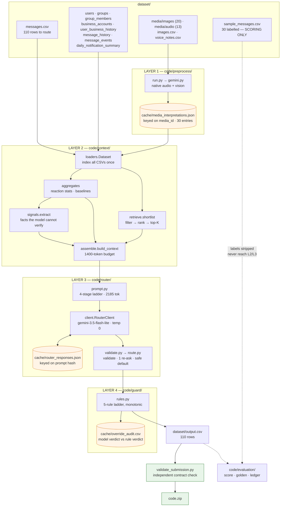
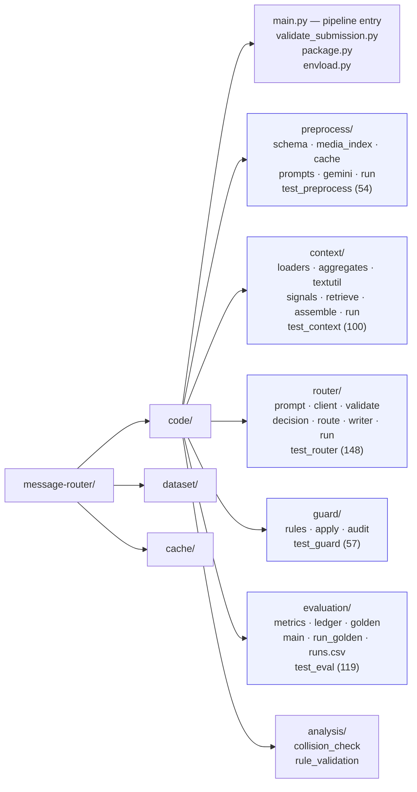
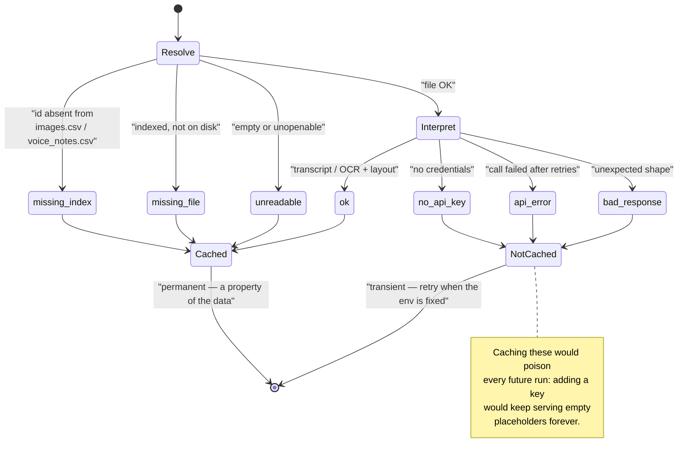
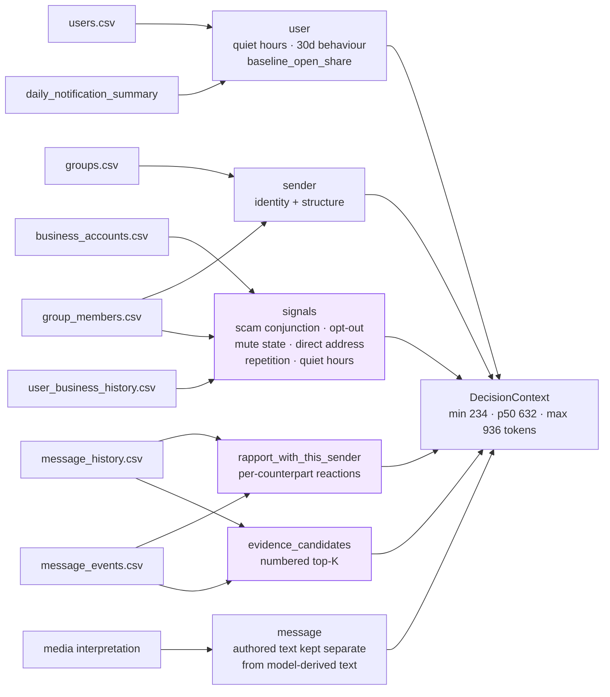
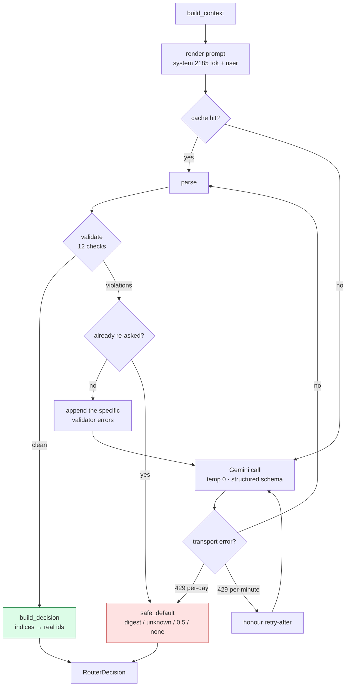
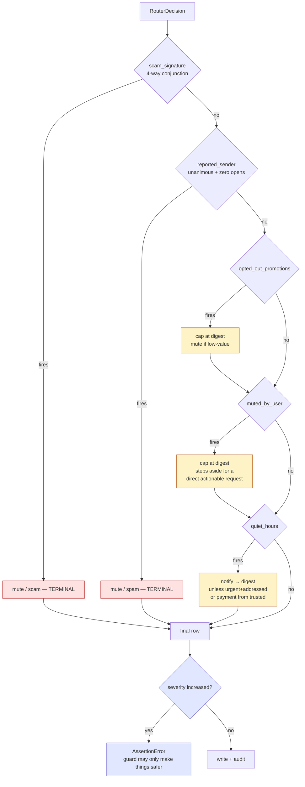
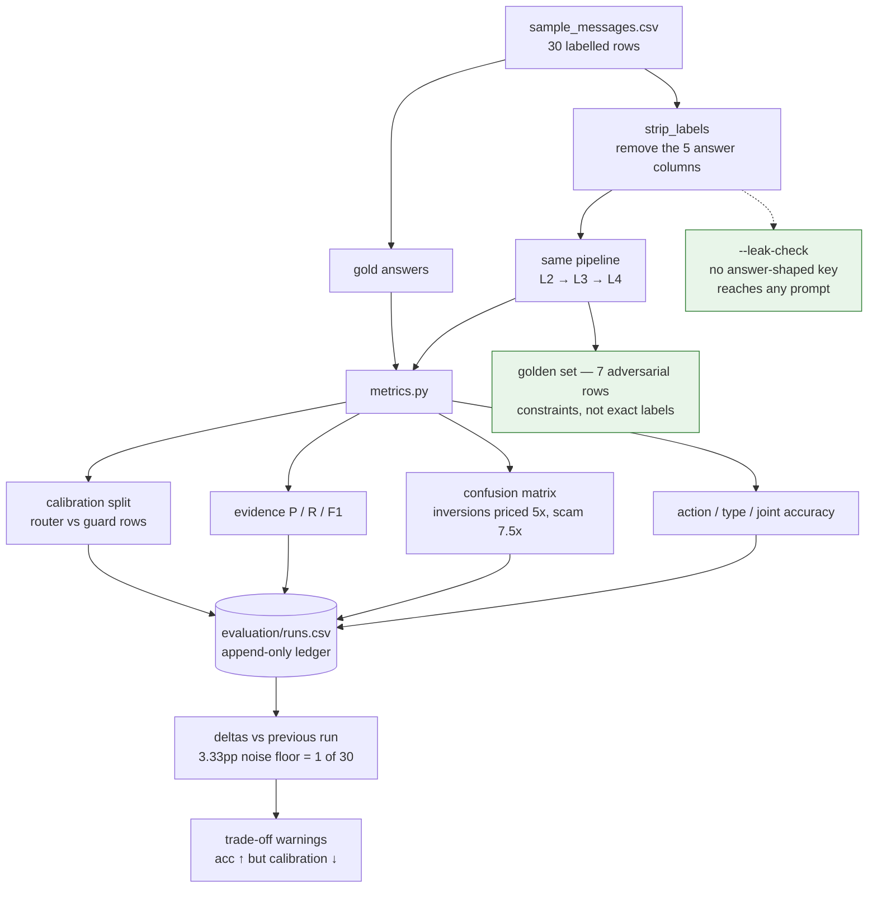
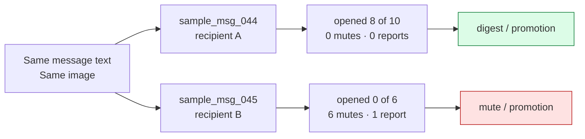

# Architecture — Message Notification Router

Seven diagrams, from the whole pipeline down to the decisions that are easy to get
wrong. Every box maps to a real module; every number is measured, not estimated.

---

## 1. System overview

The four layers, what flows between them, and where state is cached.

---

## 2. Module map

What lives where. Test suites are colocated with the layer they cover.

**478 assertions across five suites**, all offline — no network, no API key.
`analysis/` holds the two scripts that justify every threshold in the system.

---

## 3. Layer 1 — media interpretation

Every outcome is a typed record. The status decides whether it is cached, because
a data problem is permanent and an environment problem is not.

Voice notes yield a verbatim transcript plus a one-line intent summary. Images
yield OCR text, a short description, and a layout class of `stock_promo` /
`personal_screenshot` / `other`. **A row whose media fails routes on metadata
alone — it never fails the run.**

---

## 4. Layer 2 — context assembly

Which table feeds which block. Nothing is dumped raw: 756 daily-load rows become
three numbers, and a user's history becomes a ranked shortlist of at most six.

**Base rates are the point.** Open share ranges **0.17 to 0.91** across users, so
`"opened 8 of 10"` means nothing alone. The context states
`"0.00 vs 0.39 norm (below, 0.0x)"` instead.

---

## 5. Layer 3 — the routing loop

Strict validation, exactly one re-ask with the specific error injected, then a
conservative default. Nothing here repairs a bad response silently.

The 12 checks: JSON object · exactly five keys · `action` in 3 · `message_type`
in 11 · non-empty reason · confidence a real number in `[0,1]` · every evidence
index drawn from the offered shortlist · at most 2 distinct.

**Measured on the final run: 110/110 valid first try, 0 re-asks, 0 fallbacks.**

---

## 6. Layer 4 — the override guard

Runs after the model and can only hold an action or move it toward less
interruption. `apply.py` **raises** if a rule ever tries to promote a row.

`notify (2) → digest (1) → mute (0)`. Monotonicity is asserted across **110 rows
× 3 starting actions**. When a rule changes the action it also rewrites `reason`
and `confidence`, so a row never states one thing and justifies another.

---

## 7. Evaluation and the regression loop

The labelled data is read here and nowhere else.

Latest recorded run: **action 86.7% · type 70.0% · joint 66.7% · ECE 0.081 ·
cost 0.133/row · zero severe errors · golden 6/7.**

---

## 8. The decision this whole system exists for

Two rows with **identical text and the identical attached image**, sent to two
different users, labelled oppositely. Nothing in the content separates them.

Both are in the golden set. **If a change breaks exactly one of them,
personalization has collapsed back into content matching** — which is the failure
this architecture is built to prevent.

---

## Known-wrong, as of this revision

- `rule_reported_sender` overwrites `message_type` with `spam`. On labelled data
  it fired twice and was **wrong both times** (gold was `scam`). It fires **9
  times** on the submission. One-line fix, not yet made.
- `quiet_hours` downgraded two correct `notify`s (`msg_062`, `msg_077`) — admin
  event notices with real deadlines.
- Evidence F1 is **0.327** — the weakest graded axis.
- `evaluation/main.py` never calls `client.save()`, so each eval run re-pays for
  30 model calls.

See the "Known limitations" section of `code/README.md` for the full list.
